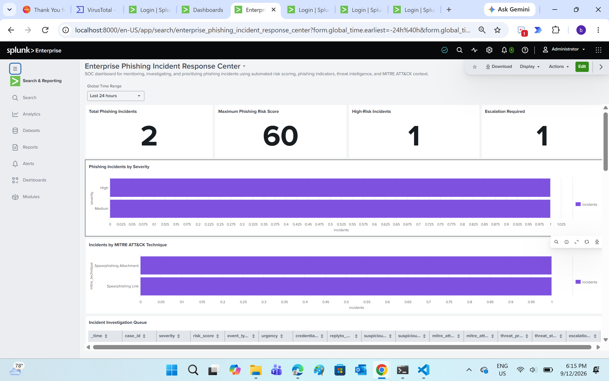
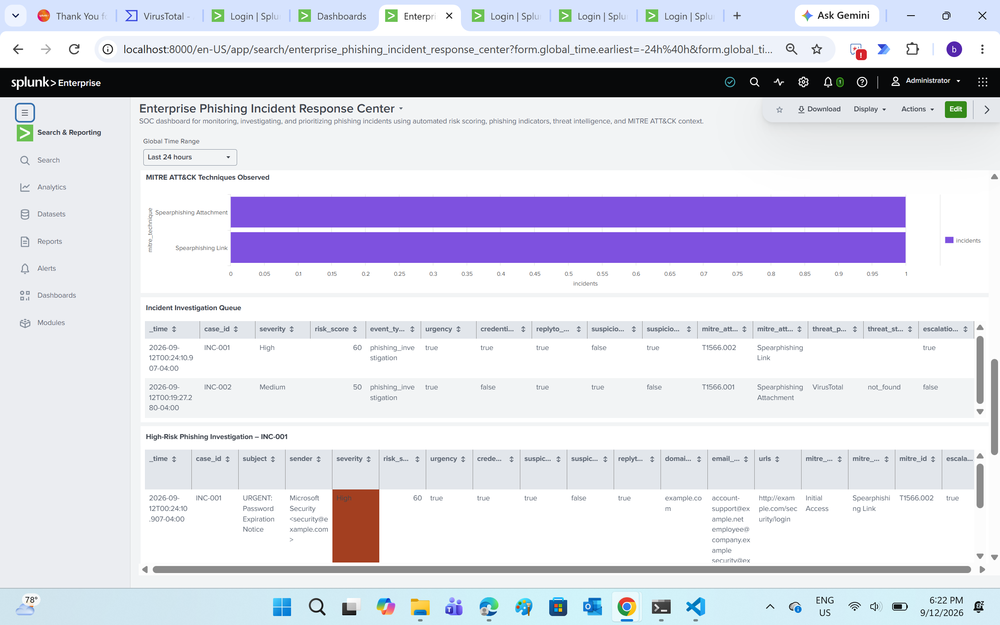
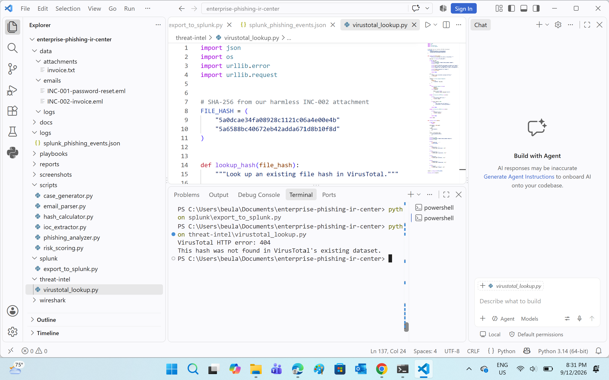
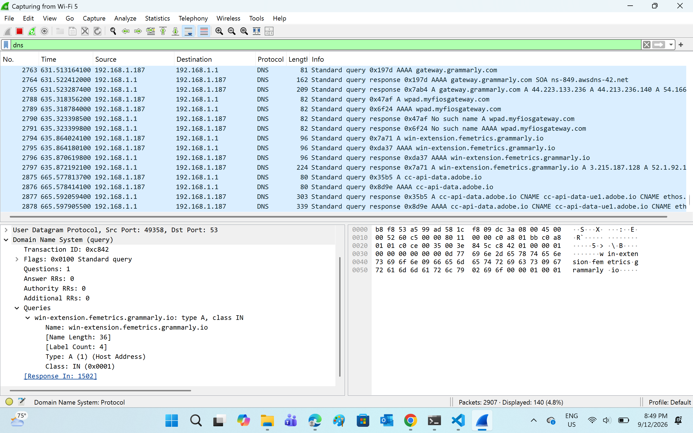

# Enterprise Phishing Incident Response Center

An enterprise-style Security Operations Center (SOC) project that simulates the detection, analysis, prioritization, investigation, and response workflow for phishing incidents.

The project combines Python-based email analysis, automated risk scoring, IOC extraction, Splunk SIEM monitoring, MITRE ATT&CK context, VirusTotal threat-intelligence enrichment, Wireshark network investigation, and documented incident-response procedures.

## Project Objectives

- Analyze suspicious phishing emails
- Extract indicators of compromise (IOCs)
- Calculate phishing risk scores
- Prioritize incidents by severity
- Generate structured incident records
- Export security events for Splunk analysis
- Build an SOC investigation dashboard
- Enrich file hashes with VirusTotal
- Investigate network activity using Wireshark
- Map phishing activity to MITRE ATT&CK context
- Document analyst findings and response procedures

## Architecture

Suspicious Email  
↓  
Email Parsing  
↓  
IOC Extraction  
↓  
Automated Risk Scoring  
↓  
Incident Generation  
↓  
Splunk SIEM  
↓  
Threat Intelligence Enrichment  
↓  
Network Investigation  
↓  
Analyst Decision  
↓  
Incident Response / Escalation

## Technologies Used

| Technology | Purpose |
|---|---|
| Python | Email parsing, IOC extraction, risk scoring and automation |
| Splunk Enterprise | SIEM investigation and SOC dashboard |
| VirusTotal API | Threat-intelligence enrichment |
| Wireshark | Packet capture and DNS/network investigation |
| MITRE ATT&CK | Adversary technique context |
| JSON | Structured incident and Splunk event data |
| Markdown | Investigation reports and response playbooks |
| VS Code | Development environment |

## Automated Phishing Analysis

The Python investigation pipeline processes suspicious email evidence and extracts security-relevant information.

Project scripts include:

- `email_parser.py` – parses email evidence
- `ioc_extractor.py` – extracts indicators such as URLs and related artifacts
- `hash_calculator.py` – calculates attachment hashes
- `risk_scoring.py` – calculates phishing risk
- `phishing_analyzer.py` – coordinates phishing analysis
- `case_generator.py` – generates structured investigation cases
- `export_to_splunk.py` – prepares events for Splunk ingestion

## Risk-Based Incident Prioritization

The project uses automated risk scoring to assist SOC triage.

Incidents can be prioritized using indicators such as:

- Suspicious URLs
- Credential-related indicators
- Attachment evidence
- Urgency indicators
- Reply-to anomalies
- Correlated phishing characteristics

The resulting risk score and severity help determine whether an incident requires further investigation or escalation.

## Splunk SOC Dashboard

Splunk Enterprise provides centralized monitoring and investigation of the simulated phishing incidents.

The dashboard includes:

- Total phishing incidents
- Maximum phishing risk score
- High-risk incidents
- Escalation-required incidents
- Incidents by severity
- MITRE ATT&CK technique context
- Incident investigation queue
- Recommended incident-response actions
- Phishing incident timeline
- Analyst investigation summary

### Dashboard Evidence



## Incident Investigation

The project demonstrates analyst-level investigation of high-risk phishing cases.

Investigation evidence includes:

- Case identifiers
- Severity
- Risk score
- Phishing indicators
- Investigation status
- Escalation decisions
- Recommended response actions



## Threat Intelligence

The project integrates a Python-based VirusTotal lookup workflow for file-hash enrichment.

The lab-generated test hash returned HTTP 404 because it was not present in VirusTotal's existing dataset.

An unknown hash is not automatically classified as safe or malicious; it requires correlation with additional evidence.



## Network Investigation

Wireshark was used to capture and analyze endpoint network activity.

The investigation focused on DNS traffic to demonstrate how SOC analysts can examine domain-resolution activity and correlate network evidence with phishing indicators.

The packet capture is preserved as:

`wireshark/05_phishing_network_investigation.pcapng`



## MITRE ATT&CK Context

The project uses MITRE ATT&CK terminology to provide standardized context for phishing behavior.

Examples represented in the lab include:

- Spearphishing Attachment
- Spearphishing Link

ATT&CK mappings should only be assigned when supported by investigation evidence.

## Incident Response

The documented response workflow covers:

Detection  
→ Triage  
→ Risk Classification  
→ Threat Intelligence  
→ SIEM Investigation  
→ Network Investigation  
→ Analyst Decision  
→ Containment  
→ Eradication  
→ Recovery  
→ Lessons Learned

The full playbook is available at:

`playbooks/phishing_incident_response_playbook.md`

## Investigation Documentation

Network investigation findings are documented in:

`reports/network_investigation_report.md`

The report records the investigation objective, evidence source, observed network activity, analyst assessment, threat-intelligence correlation, response recommendations, and conclusions.

## Project Structure

```text
enterprise-phishing-ir-center/
├── README.md
├── cases/
├── data/
│   ├── attachments/
│   └── emails/
├── docs/
├── logs/
│   └── splunk_phishing_events.json
├── playbooks/
│   └── phishing_incident_response_playbook.md
├── reports/
│   └── network_investigation_report.md
├── screenshots/
├── scripts/
│   ├── case_generator.py
│   ├── email_parser.py
│   ├── hash_calculator.py
│   ├── ioc_extractor.py
│   ├── phishing_analyzer.py
│   └── risk_scoring.py
├── splunk/
│   └── export_to_splunk.py
├── threat-intel/
│   └── virustotal_lookup.py
└── wireshark/
    └── 05_phishing_network_investigation.pcapng